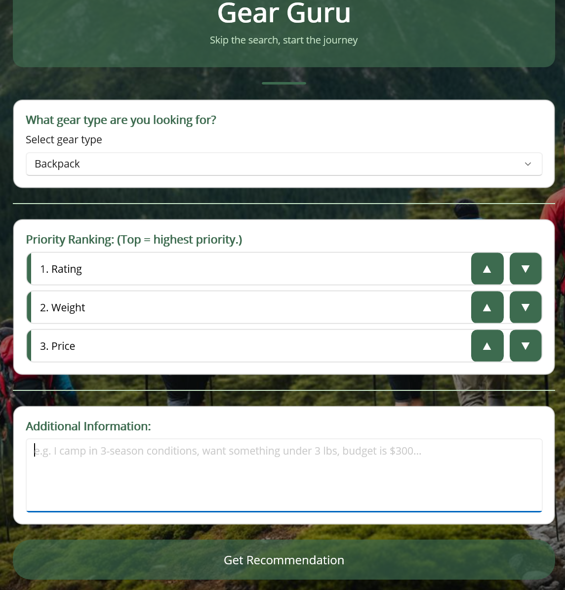

# Gear Guru (Backpacking Gear Recommender)



## How It Works

### Frontend Architecture

The user interface is built as a native desktop application using **.NET MAUI (UI Layer)**.

* **User Input & Interaction**: Captures user preferences through interactive controls. Users select a target gear category (Backpacks, Tents, or Sleeping Bags), rank their sorting priorities (Rating, Weight, Price) dynamically via UI ordering buttons, and type any specific situational preferences into an additional text prompt field.
* **Service Orchestration**: When the user clicks "Get Recommendation", the frontend passes these parameters directly to the underlying `ServiceLayer`. It acts as the bridge that orchestrates data retrieval, data sorting, and handoffs.
* **AI Recommendation Display**: Once the backend filters and sorts the catalog, the frontend forwards the curated list along with the user's custom text constraints to the Gemini LLM. The AI engine reviews the context and returns a tailored review, which is rendered directly on-screen.

### Backend Architecture

The backend manages the catalog lifecycle and processes data through structured layers.

* **Data Ingestion & Instantiation**: Raw gear items are parsed from a local JSON database. A manager identifies the item types and delegates construction to specific factories to instantiate the domain objects (`Backpack`, `Tent`, `SleepingBag`) derived from a base `Gear` class.
* **State Management**: Instantiated gear objects are held entirely in memory inside a single, globally accessible data cache handled by a repository, ensuring data uniformity across all queries.
* **Execution Logic**: Based on the UI priority selection, the service layer dynamically applies the appropriate sorting algorithm (e.g., price, weight, or rating). The filtered and organized collection is returned seamlessly back up to the presentation layer.

---

## Setup Guide & Installation

### Prerequisites

* A Google account
* [.NET 8 SDK](https://dotnet.microsoft.com/download/dotnet/8.0) installed
* Windows 10 version 1903 or higher (build 18362+)

### 1. Get a Gemini API Key

1. Go to [https://aistudio.google.com/apikey](https://aistudio.google.com/apikey)
2. Click **Create API key**, then create or select a Google Cloud project.
3. Copy the generated key.

> **Note:** If you see `limit: 0` errors, make sure the **Generative Language API** is enabled at `[https://console.cloud.google.com/apis/library/generativelanguage.googleapis.com](https://console.cloud.google.com/apis/library/generativelanguage.googleapis.com)`. The free tier is not available in all regions — if quota shows 0, you may need to enable billing.

### 2. Add Your API Key

Create a file named `secrets.json` inside your application directory (this file is gitignored and should never be committed to production):

**`src/GearRecApp/secrets.json`**

```json
{
  "GeminiApiKey": "YOUR_API_KEY_HERE"
}

```

### 3. Install the MAUI Workload

Run the following workload command once in your terminal:

```powershell
dotnet workload install maui

```

### 4. Install the Windows App Runtime

```powershell
winget install Microsoft.WindowsAppRuntime.1.5

```

### 5. Restore and Run

Navigate directly to the app directory to compile and launch the application:

```powershell
cd src/GearRecApp
dotnet restore
dotnet run -f net8.0-windows10.0.19041.0 --no-launch-profile

```

---

## Troubleshooting

| Error | Fix |
| --- | --- |
| `Class not registered (0x80040154)` | Install Windows App Runtime (step 4) |
| `secrets.json not found` | Create `src/GearRecApp/secrets.json` as shown in step 2 |
| `Google.GenAI quota limit: 0` | Enable the Generative Language API and check billing (see step 1 note) |
| `The launch profile could not be applied` | Add `--no-launch-profile` to the run command |